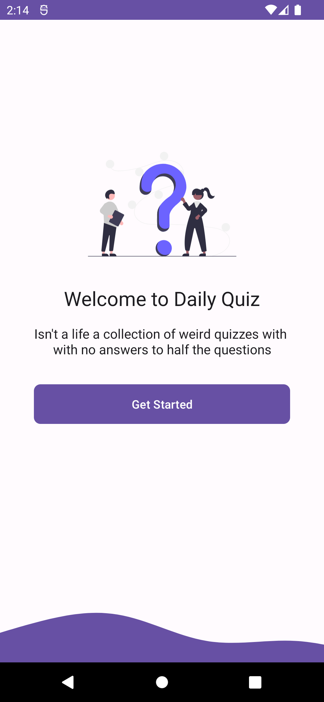
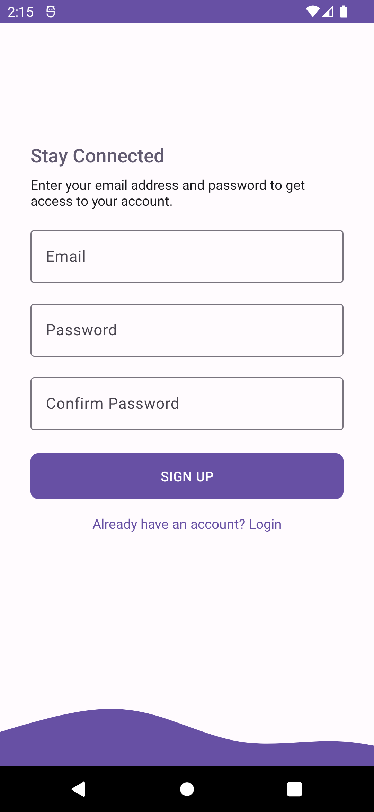
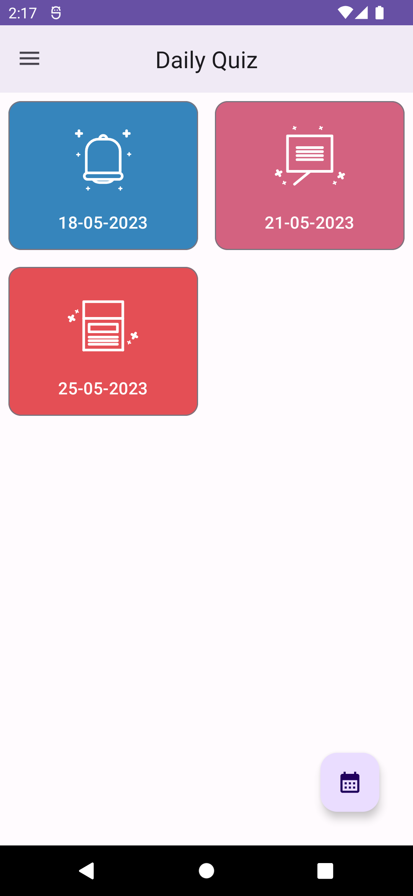
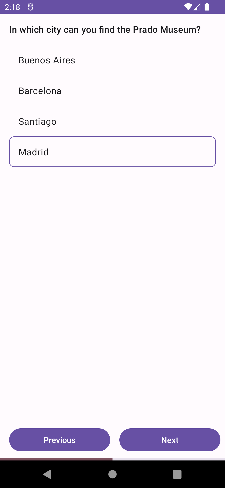

# Daily Quiz

A Quiz App made using firebase. It is based on Unidirectional Data Flow (UDF) Architecture and
Single-Activity Architecture.

## Features

1. Login/Signup authentication using email-password.
2. Email verification.
3. Forgot password feature.
4. User authentication in a clean architecture.
5. Uses Firebase Coroutine extension.
6. Attempt MCQs quiz and increase your score.
7. Retry quiz if you didn't do well.
8. Filter quiz according to month and year. (Note : Please choose month May, 2023 to get quiz
   because no quiz is published
   in other month in the firestore db with which it is connected)

## Screenshots

|                                                        |                                                       |                                                     |
|--------------------------------------------------------|-------------------------------------------------------|-----------------------------------------------------|
|  |  |  |
|     |  |                                                     |

## Built With

[**Kotlin:**](https://kotlinlang.org/) As the programming language.

[**Firebase: Cloud Firestore:**](https://firebase.google.com/docs/firestore) As the backend for fetching quizes.  

[**Firebase Auth:**](https://firebase.google.com/docs/auth) For authenticating users.  

[**Navigation
Component:**](https://developer.android.com/guide/navigation/navigation-getting-started) For
navigating between destinations (fragments)

[**ViewModel:**](https://developer.android.com/guide/navigation/navigation-getting-started) For
cashing data and persists it through configuration changes.

[**Hilt:**](https://developer.android.com/training/dependency-injection/hilt-android) For dependency
injection.

[**Kotlin Flow:**](https://developer.android.com/kotlin/flow) For flow of data from data layer to UI layer.

## Architecture

Follows Unidirectional Data Flow ([UDF](https://developer.android.com/topic/architecture)) for the
flow of data and [Single Activity Architecture](https://youtu.be/2k8x8V77CrU) for UI.

## Installation

Simply clone this repository and open it in android studio.

### Firebase Integration

See [Add Firebase to your Android project](https://firebase.google.com/docs/android/setup) to setup
connect the project with your firebase. Alternatively delete `app/google-services.json` and use
Android integrated Firebase Assistant for the setup
through `Tools/Firebase/<Any_Feature>/Connect your app to Firebase` and connect it with your
existing firebase project or create a new one. To understand the structure of firestore, see the
model classes in `data/model` package.
